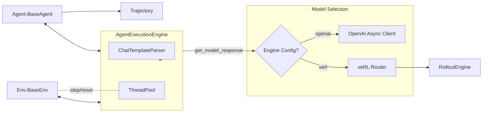
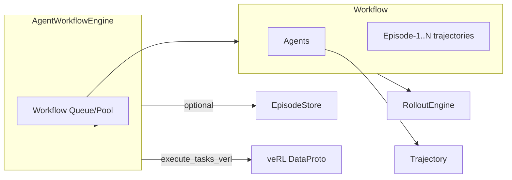
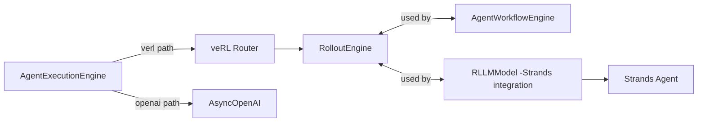
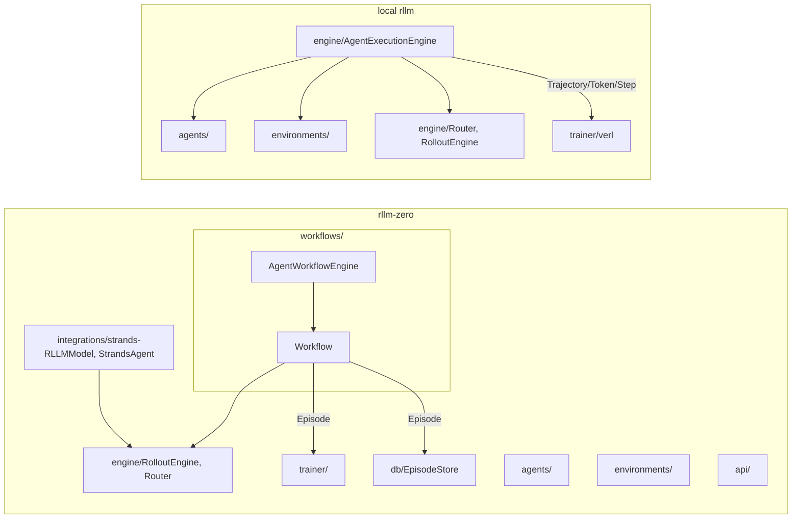

## 引言 Introduction

- 本文客观对比 `AgentWorkflowEngine` 与 `AgentExecutionEngine`（含 `AsyncAgentExecutionEngine`）、定义 `RolloutEngine` 的角色，并给出两者实现的架构图与差异。
- 最后对比 `_external/rllm-zero` 与本地 `rllm` 的整体架构差异，并附带架构图。

## 定义与定位 Definitions and Roles

### AgentExecutionEngine（含 AsyncAgentExecutionEngine）

- 中文: 面向标准 `BaseAgent`/`BaseEnv` 的并行异步采样引擎，负责初始化/复用 agent-env 实例、与模型交互、环境步进、超时/截断控制、奖励聚合与多种返回模式（Text/Token/Step/Conversation）。
- English: A parallel async sampler for standard `BaseAgent`/`BaseEnv`. Manages agent-env lifecycle, model calls, env stepping, timeout/truncation, reward aggregation, and multiple output modes (Text/Token/Step/Conversation).
- 备注 Note: `AsyncAgentExecutionEngine` 目前为空继承，等价于 `AgentExecutionEngine` 的别名。

### AgentWorkflowEngine

- 中文: 面向 `Workflow` 抽象的高层编排器，创建工作流实例池并发执行任务，支持重试与 Episode 存储；可将 `Episode` 转换为 veRL 训练所需的 `DataProto`（含 stepwise advantage、compact filtering 等）。
- English: A high-level orchestrator for `Workflow`. Manages a pool of workflows, runs tasks concurrently with retry and optional EpisodeStore; can transform `Episode` to veRL-compatible `DataProto` (supports stepwise advantage, compact filtering).

### RolloutEngine

- 中文: 统一推理后端的适配器，封装 tokenizer、chat parser 与推理端点（OpenAI 接口或 veRL 路由等），提供 `get_model_response` 等接口；可作为工作流与模型适配（例如 `integrations/strands.RLLMModel`）的基础。
- English: A unified inference backend adapter. Wraps tokenizer, chat parser, and inference endpoints (OpenAI-like or veRL router), providing `get_model_response` and related capabilities; serves as the base for workflows and model adapters (e.g., `integrations/strands.RLLMModel`).

## 架构与数据流 Architecture and Dataflow

### AgentExecutionEngine 架构 Architecture

- 中文要点:
  - 以 agent-env 槽位并发；环境 I/O 通过线程池执行。
  - 模型调用在 OpenAI/veRL 路径间切换；对话模板由 ChatTemplateParser 统一生成。
  - 产出 `Trajectory`（或 Token/Step/Conversation 模式）。
- English highlights:
  - Slot-based concurrency; env I/O via thread pool.
  - Model calls switch between OpenAI/veRL; prompts via ChatTemplateParser.
  - Produces `Trajectory` (or Token/Step/Conversation modes).

### AgentWorkflowEngine 架构 Architecture

- 中文要点:
  - 以 `Workflow` 为单位进行高层编排；工作流内部可管理单/多个 Agent。
  - 支持重试、进度与 Episode 存储；可直接输出 veRL 训练所需张量。
- English highlights:
  - Orchestrates `Workflow` units; a workflow may manage one/multiple agents.
  - Retry, progress, and Episode storage; can emit veRL training tensors.

### RolloutEngine 在两类引擎中的角色 Role of RolloutEngine

- 中文: 工作流路径直接依赖 `RolloutEngine`；Strands 集成通过 `RLLMModel` 复用 `RolloutEngine`；ExecutionEngine 在 veRL 模式下经 Router 使用 `RolloutEngine`，在 OpenAI 模式下直连 API。
- English: Workflows depend on `RolloutEngine`; Strands integration reuses it via `RLLMModel`; ExecutionEngine uses `RolloutEngine` through Router in veRL mode, and AsyncOpenAI in openai mode.

## 功能差异 Summary of Differences

- **抽象层级 Abstraction**

  - ExecutionEngine: Agent/Env 层（标准 RL 采样） | Agent/Env layer for RL sampling.
  - WorkflowEngine: Workflow 层（高阶编排与多 Agent） | Workflow layer (orchestration, multi-agent).

- **并行与资源 Parallelism**

  - ExecutionEngine: 槽位并发 + 线程池处理 env I/O。
  - WorkflowEngine: 预建工作流池 + asyncio 异步并发 + 每任务重试。

- **输出形态 Output**

  - ExecutionEngine: Trajectory/Token/Step/Conversation。
  - WorkflowEngine: Episode（含多条命名 Trajectory）与 veRL DataProto。

- **训练集成 Training**

  - ExecutionEngine: 直接供 Trainer 消费（标准采样）。
  - WorkflowEngine: 自带 Episode→DataProto 转换，便于 veRL 训练，支持 stepwise advantage/compact filtering。

- **模型后端 Backend**
  - ExecutionEngine: OpenAI/veRL 二选一；ChatTemplateParser 统一 prompt。
  - WorkflowEngine: 通过 RolloutEngine 统一；可被模型适配层（如 `RLLMModel`）复用。

## 架构对比：\_external/rllm-zero vs 本地 rllm Architecture Comparison

### 总览 Differences at a glance

- `_external/rllm-zero`：
  - 增加 `workflows/` 与 `AgentWorkflowEngine`，支持 Workflow 抽象与 Episode→veRL 转换。
  - 提供 `integrations/strands.py`（`RLLMModel` + `StrandsAgent`）以复用 RolloutEngine 并适配 Strands。
  - 示例更偏向工作流与评测 (`examples/strands/*`)，并包含 API server 与工具注册器等模块化增强。
- 本地 `rllm`（传统形态）:
  - 以 `AgentExecutionEngine` + 标准 `BaseAgent`/`BaseEnv` 为核心，直接服务训练器（verl）。
  - 无 `workflows/` 与 `AgentWorkflowEngine`；更贴近标准 RL 采样与训练闭环。

### 架构图 Architecture diagrams

- 中文: rllm-zero 在 rllm 基础上加入 `workflows` 与 `AgentWorkflowEngine`，新增 `integrations/strands` 以适配 Strands，并引入 Episode 存储与 veRL 转换路径，便于多 Agent 工作流与训练闭环对接。
- English: rllm-zero extends rllm by adding `workflows` and `AgentWorkflowEngine`, an `integrations/strands` adapter for Strands, and Episode storage + veRL conversion, enabling multi-agent workflows and smooth training loop integration.

## 结论 Conclusion

- 两类引擎面向不同抽象层：一个是标准 Agent/Env 采样器，另一个是 Workflow 编排器；都可复用 `RolloutEngine`，并可根据场景组合使用。
- rllm-zero 在架构上引入 `Workflow` 与 `Strands` 适配层，强化评测与训练的数据转换通道；本地 rllm 维持更轻量的标准 RL 采样路径。
